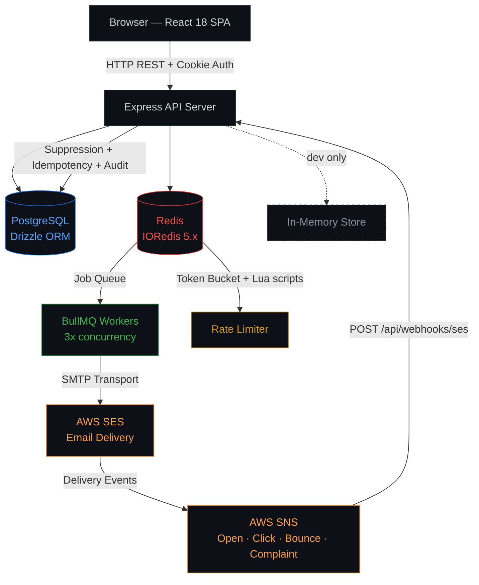
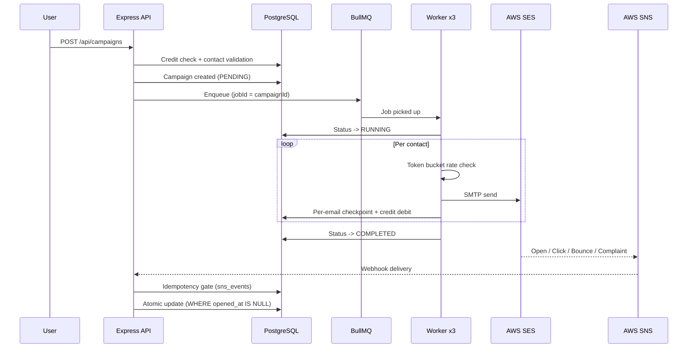

<div align="center">

<br/>

<picture>
 <pre align="center">
<pre align="center">
 _      _____ _____ _____  ______ ___________ _____ 
| |    |  ___|_   _/  ___||___  /|  ___| ___ \  _  |
| |    | |__   | | \ `--.    / / | |__ | |_/ / | | |
| |    |  __|  | |  `--. \  / /  |  __||    /| | | |
| |____| |___  | | /\__/ /./ /___| |___| |\ \\ \_/ /
\_____/\____/  \_/ \____/ \_____/\____/\_| \_|\___/ 
</pre>
</pre>

<br/>

> *Zero the stress. Zero the friction. Zero the manual load.*

<br/>

**Communication infrastructure without compromise.**

<br/>

[](https://nodejs.org)&nbsp;
[](https://react.dev)&nbsp;
[](https://postgresql.org)&nbsp;
[](https://redis.io)&nbsp;
[](https://docs.bullmq.io)&nbsp;
[](https://aws.amazon.com/ses)&nbsp;
[](https://openai.com)&nbsp;
[](https://railway.app)

<br/>

| | Product | Status |
|:-:|:--------|:------:|
| 📬 | **[RepMail](https://www.letszero.in/)** | `● LIVE` |
| 💬 | **MessageHub** | `◌ Coming Soon` |
| 🔔 | **NotifyStream** | `◌ Coming Soon` |

<br/>

[**→ Live Platform**](https://www.letszero.in/) &nbsp;&nbsp;·&nbsp;&nbsp; [Architecture](#system-architecture) &nbsp;&nbsp;·&nbsp;&nbsp; [Engineering Depth](#queue--async-execution) &nbsp;&nbsp;·&nbsp;&nbsp; [Local Setup](#local-development)

<br/>

</div>

---

<br/>

## What Is LetsZero

LetsZero is a communication infrastructure company built on a single premise: teams shouldn't spend engineering cycles on communication plumbing. Every product in the platform zeros out a specific category of operational friction — manual outreach load, messaging overhead, notification complexity.

**RepMail** is the first product. It is not a bulk email tool. It is a direct-outreach infrastructure platform for sales teams, built with async queue execution, per-email credit governance, full delivery telemetry across the bounce/complaint/open/click lifecycle, and a three-tier organizational governance model. It handles failure as a first-class concern, not an afterthought.

<br/>

## Engineering Principles

<div align="center">

| Principle | What It Means in Practice |
|:----------|:--------------------------|
| **Availability over convenience** | The system degrades gracefully. It never halts silently. |
| **Delivery truth over cosmetic consistency** | Accurate metrics, even when the number is bad. |
| **Explicit operational visibility** | Every state change is logged, timestamped, and attributable. |
| **Failure recovery over silent retries** | The system knows what failed, why, and how to recover. |
| **Complexity must be earned** | No abstraction exists without a documented reason. |

</div>

<br/>

## Platform Ecosystem

```
LetsZero
├── RepMail        LIVE      Enterprise email campaign infrastructure
├── MessageHub     Soon      Unified messaging and routing platform
└── NotifyStream   Soon      Multi-channel notification engine
```

RepMail is the reference implementation. Its architecture, governance model, and operational patterns define the blueprint for every product that follows.

<br/>

## System Architecture



<br/>

## Campaign Execution Lifecycle



> If Redis is unavailable at enqueue time, execution falls back to synchronous inline processing. No data loss. No silent failure.

<br/>

## Queue & Async Execution

<div align="center">

| Property | Detail |
|:---------|:-------|
| Queue engine | BullMQ 5.x over IORedis |
| Deduplication | `jobId = campaignId` — re-enqueue is always a safe no-op |
| Worker concurrency | 3 simultaneous campaigns per process |
| Rate limiting | Dual Lua scripts (`ACQUIRE` + `RELEASE`) on Redis |
| Fairness cap | 60% throughput ceiling per campaign across concurrent workers |
| Scheduler | 30s polling for elapsed `scheduledAt` campaigns |
| Shutdown | SIGTERM drains in-flight jobs within 30s Railway grace window |
| Fallback | Redis down → synchronous inline execution |
| Observability | Every transition written to `audit_logs` with full metadata |

</div>

<br/>

## Delivery Pipeline

```
Outbound:   Worker → Nodemailer SMTP → AWS SES → Inbox
                                           |
Inbound:    SES Events → SNS Topic → POST /api/webhooks/ses
                                           |
                              SNS Signature Verification
                                           |
                              Idempotency Gate (sns_events table)
                                           |
                         Open · Click · Bounce · Complaint Router
                                           |
                        Atomic DB Update (WHERE opened_at IS NULL)
                                           |
                              Suppression System (auto-blocklist)
```

**Why SMTP over the AWS SDK:** Nodemailer's transport layer injects `X-SES-CONFIGURATION-SET` headers without coupling campaign logic to AWS SDK version constraints.

**Why application-layer deduplication:** SNS delivers at-least-once. A single bounce event updates metrics multiple times without an idempotency gate. The `sns_events` uniqueness constraint handles this at the data layer.

<br/>

## Governance & Credit System

```
ROOT_ADMIN
│  Full platform visibility. Emergency recovery access.
│  No inactivity governance.
│
└── SUB_ADMIN
│     Creates and manages USER accounts.
│     Allocates credits from own pool downward.
│     Inactivity lifecycle: 30 / 60 / 90-day stages.
│
    └── USER
          Sends campaigns. Uses AI features.
          Full credit governance and inactivity lifecycle.
```

<br/>

<div align="center">

| Credit Rule | Behavior |
|:------------|:---------|
| Direction | Credits flow downward only: ROOT → SUB_ADMIN → USER |
| Accounting | Every movement is an immutable ledger entry with before/after balance |
| Reclamation | Automated on inactivity at configured thresholds |
| Balance formula | `received - allocated - used` (computed, never stored) |
| Campaign gate | Credit check at execution time, not campaign creation |

</div>

<br/>

## Why These Architecture Decisions

**BullMQ over raw async loops**
`jobId = campaignId` guarantees a campaign is never enqueued twice regardless of concurrent requests. Raw async loops have no deduplication, no retry semantics, and no worker isolation.

**SES via SMTP, not SDK**
Nodemailer's transport decouples delivery from AWS SDK version churn. Configuration-set headers are injected at the transport layer, keeping campaign logic clean.

**Storage abstraction (`IStorage` interface)**
Development runs on an in-memory Map-based store with zero setup. Production runs on PostgreSQL via Drizzle ORM. Identical function signatures, no code changes between modes.

**SNS idempotency at the application layer**
SNS is at-least-once. Trusting the transport to deliver exactly once is a guaranteed source of metric drift. The `sns_events` table enforces uniqueness at the message ID level.

**Inline fallback execution**
When Redis is unavailable, campaigns send synchronously. Slower, but correct. Availability is never traded for infrastructure convenience.

**Immutable credit ledger**
Every credit movement is a permanent record. Any balance discrepancy can be reconstructed from the transaction log alone. No derived state is trusted over the ledger.

<br/>

## Failure Recovery

<div align="center">

| Failure Mode | Recovery Behavior |
|:-------------|:------------------|
| Redis unavailable | Falls back to synchronous inline execution |
| Process crash mid-campaign | Restart re-picks job; per-email DB state prevents resends |
| Duplicate SNS event | `sns_events` constraint discards before any DB mutation |
| Worker retry | Checks `campaign_emails.status` first — data-driven, not status-driven |
| Campaign enqueued twice | `jobId = campaignId` makes second enqueue a no-op |
| Stale RUNNING campaigns on boot | Startup recovery job detects and re-enqueues |
| Credits exhausted mid-send | Campaign transitions to FAILED; partial sends recorded; audit entry written |

</div>

<br/>

## Operational Guarantees

- No duplicate SNS event is processed — enforced by `sns_events` uniqueness constraint
- No suppressed contact re-enters a send queue — suppression checked at worker execution
- No delivered email is ever retried — `campaign_emails.sent_at` checked before every send attempt
- Campaign state survives process crashes — BullMQ persistence and per-email DB checkpointing
- Credit balances are always reconstructible — full immutable ledger in `credit_transactions`
- Inactivity governance runs on an automated schedule, not a manual admin trigger

<br/>

## AI Features

<div align="center">

| Feature | What It Does |
|:--------|:-------------|
| Template Generation | Subject and body from a plain-text brief |
| Personalized Preview | Renders up to 3 sample contacts with merge-field substitution |
| Spam Analysis | Scores templates against deliverability heuristics with actionable output |

</div>

Every call is logged: model, token counts, cost estimate, latency, SHA-256 request hash, cache hit flag. Daily per-user quotas are enforced and reset on schedule. Cache hits do not count against quota.

<br/>

## Tech Stack

<div align="center">

**Frontend**

| Technology | Role |
|:-----------|:-----|
| React 18 | UI framework |
| Vite | Build tool and HMR dev server |
| TanStack Query v5 | Server state, caching, invalidation |
| Tailwind CSS + shadcn/ui | Styling and accessible components |
| Framer Motion | Page transitions and micro-interactions |
| React Hook Form + Zod | Form handling with schema validation |
| Recharts | Dashboard analytics charts |
| xlsx (SheetJS) | Client-side CSV and Excel parsing |

**Backend**

| Technology | Role |
|:-----------|:-----|
| Node.js (ESM) + Express 4 | Runtime and HTTP server |
| Drizzle ORM + drizzle-zod | Type-safe PostgreSQL ORM |
| BullMQ 5.x + IORedis | Async job queue and Redis client |
| Nodemailer | Email delivery over SES SMTP |
| OpenAI SDK | GPT-4 for template gen, preview, spam scoring |
| Passport.js + express-session | Auth and session management |
| Stripe + Razorpay | Dual-gateway payments (USD + INR) |
| Zod | Runtime validation |

</div>

<br/>

## Local Development

```bash
git clone https://github.com/AKSINGH-0704/Let-sZero.git
cd Let-sZero
npm install
npm run dev
```

No database. No Redis. No AWS credentials. The in-memory storage shim handles everything locally. A `ROOT_ADMIN` account is created automatically on first boot.

Server starts at `http://localhost:5000`.

<br/>

<div align="center">

**Key Environment Variables (Production)**

| Variable | Description |
|:---------|:------------|
| `DATABASE_URL` | PostgreSQL connection string |
| `REDIS_URL` | Redis connection string |
| `AWS_SES_HOST` / `USER` / `PASS` | SES SMTP credentials |
| `SES_CONFIGURATION_SET` | AWS configuration set for event routing |
| `SES_RATE_PER_SECOND` | Must match your SES account sending limit |
| `OPENAI_API_KEY` | GPT-4 access |
| `STRIPE_SECRET_KEY` / `RAZORPAY_KEY_ID` | Payment gateways |
| `SESSION_SECRET` | Express session signing key |
| `SNS_TOPIC_ARN` | Restricts webhooks to known SNS topic only |

</div>

<br/>

```bash
npm run dev        # Development — HMR + in-memory storage
npm run build      # Production build: Vite → dist/public/ + esbuild → dist/index.cjs
npm run start      # Start production server
npm run db:push    # Push Drizzle schema to PostgreSQL
npm run check      # TypeScript type check
```

<br/>

## Deployment

RepMail runs on Railway as three services in one project:

```
Railway Project: LetsZero
├── Web        Node.js — Express API + React SPA
├── Postgres   Primary database
└── Redis      BullMQ queue + rate limiter
```

`dist/index.cjs` serves both `/api/*` routes and the React SPA from a single deployable. Vercel config is also included — all routes proxy to the same bundle.

<br/>

## Project Structure

<details>
<summary>View full directory tree</summary>

```
Let-sZero/
├── client/src/
│   ├── components/
│   │   ├── ui/                  shadcn/ui primitives
│   │   ├── campaign/            Campaign wizard steps
│   │   ├── dashboard/           Dashboard widgets
│   │   └── layout/              Shell, nav, sidebar
│   ├── contexts/
│   │   ├── AuthContext.jsx      Auth state + role checks
│   │   ├── CampaignContext.jsx  7-step wizard state
│   │   └── ThemeContext.jsx     Dark/light persistence
│   ├── pages/
│   │   ├── Landing.jsx          LetsZero marketing
│   │   ├── RepMailLanding.jsx   RepMail product page
│   │   ├── Dashboard.jsx
│   │   ├── NewCampaign.jsx      7-step wizard
│   │   ├── History.jsx
│   │   ├── Templates.jsx
│   │   ├── Users.jsx
│   │   ├── Audit.jsx
│   │   └── Payments.jsx
│   └── lib/queryClient.js       TanStack Query + apiRequest()
│
├── server/
│   ├── index.js                 Entry point + startup recovery
│   ├── routes.js                All API route handlers
│   ├── storage.js               IStorage interface + mode selector
│   ├── memoryStorage.js         In-memory dev shim
│   ├── queue.js                 BullMQ setup + worker
│   ├── rateLimiter.js           Token bucket (Lua scripts)
│   ├── aiService.js             OpenAI integration
│   ├── emailService.js          Nodemailer + SES
│   ├── snsHandler.js            SNS webhook processor
│   └── cleanupJobs.js           Scheduled maintenance
│
├── shared/schema.js             Drizzle tables + Zod schemas + constants
└── script/build.js              Production build orchestrator
```

</details>

<details>
<summary>View API endpoint groups</summary>

| Group | Endpoints |
|:------|:---------:|
| Authentication | 4 |
| Dashboard | 2 |
| User Management | 6 |
| Credit Management | 4 |
| Campaigns | 6 |
| Templates | 5 |
| AI and Analysis | 3 |
| Pricing and Payments | 4 |
| Contact and Waitlist | 3 |
| Admin | 5 |
| Webhooks and Utility | 3 |

All endpoints prefixed `/api/`. Auth via HTTP-only session cookie or `Authorization: Bearer <token>`.

</details>

<br/>

---

<div align="center">

<br/>

Built by **[AKSINGH-0704](https://github.com/AKSINGH-0704)**

[letszero.in](https://www.letszero.in/) &nbsp;·&nbsp; Communication infrastructure without compromise.

<br/>


<br/>

</div>
